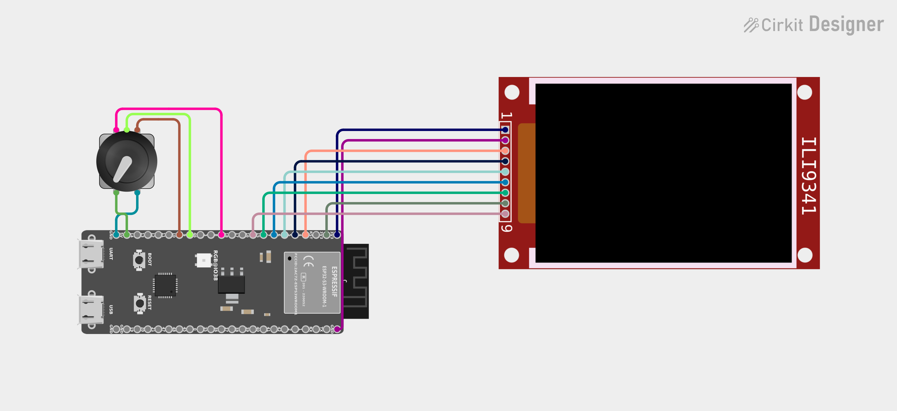

# Pixel Raindeer
#### A pixel-art messaging device for long distance relationships/friendships

# VIDEO TBD

## Inspiration

This is not an original idea, I was inspired to create this project whilst watching an instagram reel posted by [fishlooker](https://www.instagram.com/fishlooker/) specifically [this video](https://www.instagram.com/p/DU_0Hx5CRRT/). One thing I opted to change was to use a rotary encoder rather than pushbuttons, I felt that this made navigating easier and more intuitive.

## Features 

* Multiple animation packs
* Multiple animations per pack
* Easy to add animations/packs
* Custom image to header converter
* Queue to show multiple messages one after the other

## Hardware

| Part            | Model                | Qty |
| --------------- | -------------------- | --- |
| Microcontroller | ESP32 Dev Board      | 2   |
| Display         | 24'' TFT SPI 240x320 | 2   |
| BreadBoard      |                      | 2   |
| Button          | Rotary Encoder       | 2   |

## Wiring

| ESP Pin | Device         | Device Pin |
| ------- | -------------- | ---------- |
| 13      | Display        | MISO       |
| 3v3     | Display        | LED        |
| 12      | Display        | SCK        |
| 11      | Display        | MOSI       |
| 6       | Display        | DC         |
| 5       | Display        | RESET      |
| 4       | Display        | CS         |
| GND     | Display        | GND        |
| 3V3     | Display        | VCC        |
| 10      | Rotary Encoder | Switch     |
| GND     | Rotary Encoder | GND        |
| 9       | Rotary Encoder | OUT A      |
| GND     | Rotary Encoder | GND        |
| 8       | Rotary Encoder | OUT B      |


## Libraries 

* WiFiClientSecure
* WiFi
* PubSubClient
* freertos/FreeRTOS
* freertos/queue
* Adafruit_ILI9341
* Adafruit_GFX
* SPI

## Communication (MQTT)

Each device connects to a shared **HiveMQ** broker over Wi-Fi and talks to its paired device using two hardcoded topics — one for sending, one for receiving.

| Topic         | Direction       | Payload                      |
| ------------- | --------------- | ---------------------------- |
| Tonina/invia  | Device → Broker | `pack_index,animation_index` |
| Tonina/riceve | Broker → Device | `pack_index,animation_index` |

The payload is a comma-separated pair of numbers — pack index and animation index — mapping directly to the animation headers on the receiving device.

When a message arrives, it's pushed onto a queue and played back in order; all queue and playback logic runs on the device itself, not the broker.

To setup the credentials used by MQTT modify the necessary values inside of "Config.h"

> **Note:** Wi-Fi/MQTT reconnect and offline handling isn't implemented yet.

## Project Structure
```
pixel_raindeer/
|-- LICENSE
|-- README.md
|-- docs/
|	└-- circuit_image.png
|-- pixel_raindeer/
|   |-- affectionDeerSprite.h
|   |-- AnimPack.h
|   |-- Encoder.h
|   |-- Encoder.cpp
|   |-- pixel_raindeer.ino
|   |-- SpriteAnim.h
|   |-- SpriteAnim.cpp
|   |-- SpriteMenu.h
|   |-- SpriteMenu.cpp
|   |-- screen_setup.h
|   |-- screen_setup.cpp
|   └-- Config.h
└-- tools
    |-- bin_to_header.py
    |-- bin_to_header_runner.bat
    |-- image_to_565.py
    └-- image_to_bin.bat
```

## Getting started

1. Clone the repo.
2. Open `pixel_raindeer/pixel_raindeer.ino` in Arduino IDE.
3. Install the required libraries via the Library Manager (see **Libraries** above).
4. Inside `Config.h` fill in your Wi-Fi credentials, HiveMQ details, and pin assignments.
5. Select your ESP32 board and port, then upload.
6. **Repeat steps 1–5 on the second device** — both must be configured with the same MQTT broker and topics to talk to each other.
## Adding custom animations

1. Find animation and divide frames into .PNGs
2. Move to directory which contains the .PNGs and run inside cmd
```
	image_to_bin.bat "[path_to_image_to_565.py_file]"
```
3. This will transform the .PNGs into .bin files that contain RGB565 colour codes
4. Once the .bins are created run this command inside cmd where the .bin files are located
```
	bin_to_header_runner.bat "[path_to_bin_to_header.py]"
```
5. this will create the headers which represent the animation frames for the messages
**Note:** Inside bin_to_header_runner.bat I have hardcoded settings useful for me, it is important to check that these settings work correctly for your use case and change the "--out DeerSprite.h" to the name you prefer.
